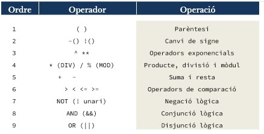
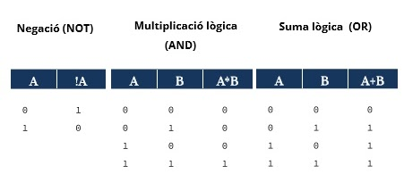

# Disseny d'algorismes

## 2.1. Anàlisi
En aquesta fase inicial, s'analitza el problema a resoldre: quina és la solució requerida, quines dades tenim, 
com es pot solucionar i quins errors poden sorgir. Si hi ha informació addicional, com fórmules, s'ha d'incloure.

Un algorisme ben format ha de ser:

- Precís: ha d'indicar cada pas per resoldre el problema. 
- Ben definit: sempre produeix la mateixa sortida amb les mateixes dades.
- Finit: ha de finalitzar en algun moment.
- Robust: ha de gestionar qualsevol entrada de manera clara.
- Transportable: ha de funcionar en qualsevol maquinari o sistema operatiu.

A més, cal resoldre preguntes sobre què es demana, quines dades tenim, quines operacions calen, si la solució resol 
el problema i si hi pot haver errors.

### 2.1.1. Les dades

#### Què és una dada?
Una dada és una representació simbòlica d'una característica d'una entitat, sense valor semàntic per si sola. 
Quan és processada, pot ser útil per a càlculs o presa de decisions. Els programes necessiten dades d'entrada, 
les transformen, i generen dades de sortida valuoses per a l'usuari. No totes les dades són iguals: poden ser nombres, 
textos, etc., i el tipus de dada defineix els valors vàlids i les transformacions que es poden fer sobre elles.

#### Tipus de dades
Els tipus de dades que es faran servir en el disseny d'algorismes (i la seva posterior implementació en un llenguatge d'alt nivell) es classifiquen en:

**Simples**

- numèriques
  - enter: representa un valor numèric, positiu o negatiu, sense cap decimal
  - real: representa un valor numèric, positiu o negatiu, amb decimals
- no numèriques
  - booleà: representa un valor de tipus lògic per tal d’establir la certesa o falsedat d’un estat o afirmació
  - caràcter, cadena de caràcters: representa una unitat fonamental de text usada en qualsevol alfabet, un nombre o un signe de puntuació o exclamació

**Estructurades**
- internes
  - estàtiques (registres, vectors, taules)
  - dinàmiques (llistes, cues, piles, arbres)
- externes
  - fitxers
  - bases de dades

### 2.1.2. Les expressions

#### Què és una expressio?
Una expressió és la representació de diversos operands, units entre ells mitjançant operadors, 
per tal de realitzar una acció sobre ells, ja sigui aritmètica, lògica o d'ambdues:
```c#
5.3 == ‘4’
5 || 4.0
!(40>25)
10<20 && 40>25
5 != 6
num = 3 * entrada
```

Una variable emmagatzema dades a la memòria i es pot modificar en qualsevol moment.
Una constant es similar, però es defineix a l'inici i ja no pot ser modificada.
Els operadors permeten assignar valors, operar i establir condicions, i hi ha els següents tipus:
- assignació: x = y
- aritmètics:
  - addició: x = x + y
  - sostracció: x = x - y
  - multiplicació: x = x * y
  - divisió: x = x / y
  - mòdul: x = x % y
  - increment: ++
  - decrement: --
  - potenciació: **
- comparació:
  - == (igual)
  - != (diferent)
  - < (menor que),  > (més gran que)
  - <=  (menor o igual que), >= (més gran o igual que)

Ordre d'avaluació d'expressions:



A l'hora d'avaluar les expressions lògiques farem servir les taules de veritat de l'àlgebra de Boole:



## 2.2. Disseny
